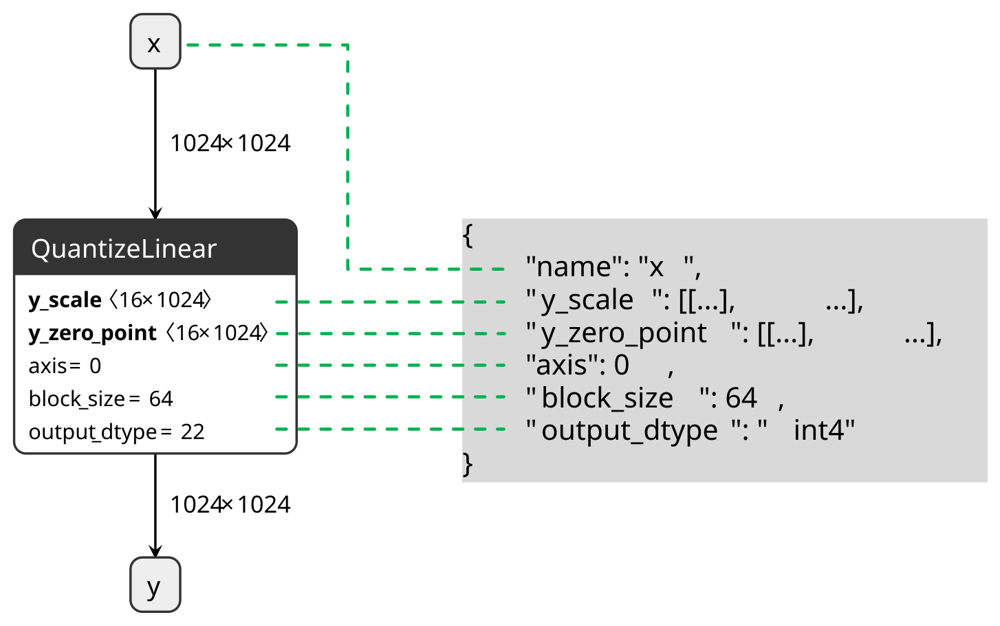
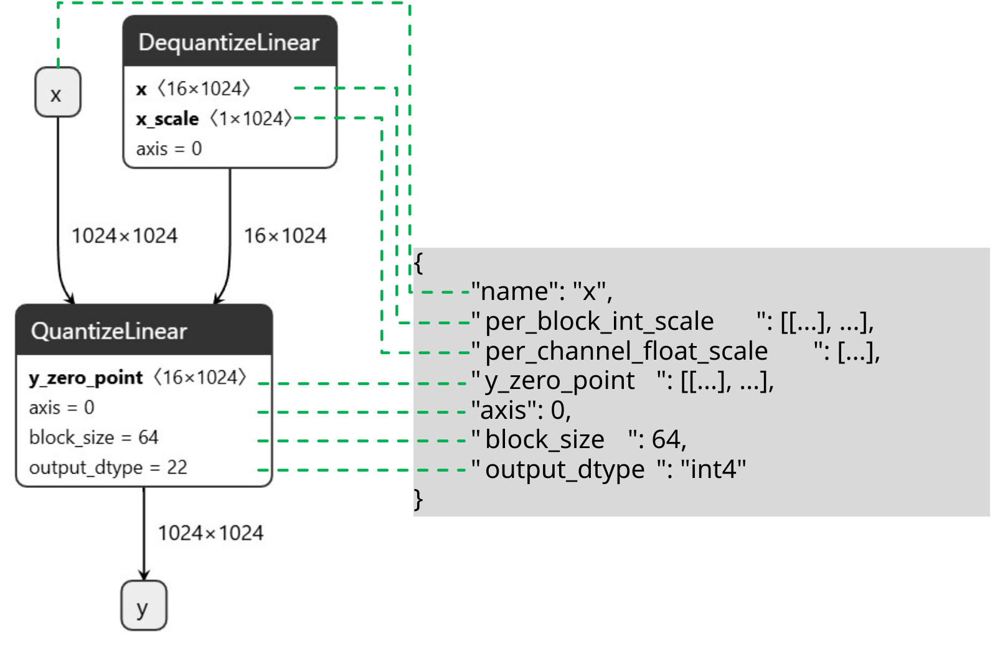

:orphan:

.. include:: ../abbreviation.txt

.. _quantsim-encoding-spec:

#############################
Encoding Format Specification
#############################

AIMET Quantization Simulation computes scale and offset values for activation and parameter tensors.
These values, known as quantization encodings, are exported alongside the model via
:func:`QuantizationSimModel.export` (aimet-onnx) or :func:`QuantizationSimModel.onnx.export` (aimet-torch).
The resulting encoding file can be consumed by target runtimes such as |qnn|.

1. Version 2.0.0 (latest)
=========================

Version 2.0.0 introduces a new JSON schema for quantization encodings that is fully aligned with
`onnx::QuantizeLinear <https://onnx.ai/onnx/operators/onnx__QuantizeLinear.html>`_ (opset 23).

1.1. Per-Tensor/Channel/Block Encodings
---------------------------------------

Each field in the encoding maps directly to an input or attribute of an ``onnx::QuantizeLinear`` node:

.. list-table::
   :header-rows: 1
   :widths: 20 25 15 40

   * - Field
     - Type
     - Mandatory
     - Description
   * - ``name``
     - string
     - Yes
     - Name of the tensor associated with this encoding
   * - ``output_dtype``
     - string
     - Yes
     - Data type of the quantized tensor. One of: ``int2``, ``uint2``, ``int4``, ``uint4``, ``int8``, ``uint8``, ``int16``, ``uint16``, ``int32``, ``float4e2m1``, ``float8e4m3fn``, ``float8e4m3fnuz``, ``float8e5m2``, ``float8e5m2fnuz``.
   * - ``y_scale``
     - float or nested list of float
     - Yes
     - Quantization scale
   * - ``y_zero_point``
     - int, float, or nested list
     - No
     - Quantization zero point. Defaults to zero if omitted. May be float for 2-bit encodings.
   * - ``axis``
     - int
     - No
     - Channel or block axis. Required for per-channel and per-block quantization.
   * - ``block_size``
     - int
     - No
     - Block size. Required for per-block quantization.

Examples
^^^^^^^^

**Per-tensor encoding:**

.. code-block:: json

    {
        "name": "tensor_name",
        "y_scale": 0.01,
        "y_zero_point": 41,
        "output_dtype": "uint8"
    }

**Per-channel encoding (channel_axis=0):**

.. code-block:: json

    {
        "name": "tensor_name",
        "y_scale": [0.01, 0.02, 0.03],
        "y_zero_point": [0, 0, 0],
        "axis": 0,
        "output_dtype": "int8"
    }

**Per-block encoding (channel_axis=0, block_axis=1, block_size=32):**

.. code-block:: json

    {
        "name": "tensor_name",
        "y_scale": [
            [0.01, 0.02],
            [0.03, 0.04],
            [0.05, 0.06]
        ],
        "y_zero_point": [
            [0, 0],
            [0, 0],
            [0, 0]
        ],
        "axis": 1,
        "block_size": 32,
        "output_dtype": "int4"
    }

**int32 encoding (for bias quantization in QNN/HTP):**

.. code-block:: json

    {
        "name": "tensor_name",
        "y_scale": [0.01, 0.02, 0.03],
        "y_zero_point": [0, 0, 0],
        "axis": 0,
        "output_dtype": "int32"
    }

**int2 encoding with standard grid [-2, -1, 0, 1]:**

.. code-block:: json

    {
        "name": "weight",
        "y_scale": [0.01, 0.02, 0.03],
        "axis": 0,
        "output_dtype": "int2"
    }

**int2 encoding with custom grid [-3, -1, 1, 3]:**

Custom grids use a floating-point ``y_zero_point`` of ``-0.5``.

.. code-block:: json

    {
        "name": "weight",
        "y_scale": [0.01, 0.02, 0.03],
        "y_zero_point": [-0.5, -0.5, -0.5],
        "axis": 0,
        "output_dtype": "int2"
    }

**Omitting y_zero_point:**

The ``y_zero_point`` field may be omitted when all values are zero. The following encodings are equivalent:

.. code-block:: json

    {
        "name": "tensor_name",
        "y_scale": [0.01, 0.02, 0.03],
        "y_zero_point": [0, 0, 0],
        "axis": 0,
        "output_dtype": "int8"
    }

.. code-block:: json

    {
        "name": "tensor_name",
        "y_scale": [0.01, 0.02, 0.03],
        "axis": 0,
        "output_dtype": "int8"
    }

1.2. LPBQ Encodings
-------------------

LPBQ (Low-Precision Block Quantization) encodings decompose blockwise ``y_scale`` into two components:
``per_block_int_scale`` and ``per_channel_float_scale``. This corresponds to an ONNX graph
where a ``DequantizeLinear`` node computes the effective scale, which is then fed into a
``QuantizeLinear`` node:

.. list-table::
   :header-rows: 1
   :widths: 25 25 15 35

   * - Field
     - Type
     - Mandatory
     - Description
   * - ``name``
     - string
     - Yes
     - Name of the tensor associated with this encoding
   * - ``output_dtype``
     - string
     - Yes
     - Data type of the quantized tensor
   * - ``per_block_int_scale``
     - nested list of int
     - Yes
     - Per-block integer scale
   * - ``per_channel_float_scale``
     - nested list of float
     - Yes
     - Per-channel float scale
   * - ``y_zero_point``
     - int or nested list of int
     - No
     - Quantization zero point. Defaults to zero if omitted.
   * - ``axis``
     - int
     - No
     - Block axis.
   * - ``block_size``
     - int
     - Yes
     - Block size.

The effective scale is: ``y_scale = per_block_int_scale * per_channel_float_scale``

The channel axis can be inferred from the shapes of ``per_channel_float_scale`` and ``per_block_int_scale``.

2. Version 1.0.0
================

Changes from 0.6.1:

* Activation and parameter encodings are now no longer dictionaries mapping tensor names to encoding dictionaries, but instead are lists of encoding dictionaries where the tensor names are another entry in the encoding dictionary.
* Fields present in the encoding dictionary have been reworked or removed for conciseness. Refer to the table below for details on which fields are present for each encoding type.
* Notably, per channel encodings are now contained in a single encoding dictionary instead of a list of encodings with length num_channels. Instead, ``scale`` and ``offset`` fields are now 1-D arrays of length num_channels.
* Encodings for per-block quantization and Low Power Blockwise Quantization are now supported.

2.1. Encoding specification
---------------------------

.. list-table:: Top level structure
   :header-rows: 1

   * - Key
     - Value type
     - Description
   * - version
     - string
     - Encoding file version
   * - activation_encodings
     - list of Encoding dictionaries
     - Encodings for each activation tensor
   * - param_encodings
     - list of Encoding dictionaries
     - Encodings for each param tensor
   * - quantizer_args
     - dict
     - Arguments used to instantiate QuantizationSimModel (refer to Quantizer Args structure for details)
   * - excluded_layers
     - list
     - List of excluded layers

The below table describes how the Encoding dictionary looks for different quantization types: Per Tensor, Per Channel, Per Block, and Low Power Blockwise Quantization (LPBQ).
Certain keys will only be present for certain quantization types, as indicated in the table.

.. list-table:: Encoding dictionary structure
   :header-rows: 1

   * - Key
     - Value type
     - Description
     - Per Tensor
     - Per Channel
     - Per Block
     - LPBQ
   * - name
     - string
     - Tensor name
     - X
     - X
     - X
     - X
   * - enc_type
     - string
     - Encoding type (refer to EncodingType for valid strings)
     - X
     - X
     - X
     - X
   * - dtype
     - string
     - Data type (refer to DataType for valid strings)
     - X
     - X
     - X
     - X
   * - block_size
     - uint32
     - Block size
     -
     -
     - X (INT only)
     - X
   * - bw
     - uint8
     - Encoding bw (>=4 and <= 32)
     - X
     - X
     - X
     - X
   * - is_sym
     - bool
     - True if encoding is symmetric, False otherwise
     - X (INT only)
     - X (INT only)
     - X (INT only)
     - X
   * - scale
     - fp32[]
     - Flattened array of scales
     - X (INT only)
     - X (INT only)
     - X (INT only)
     - X
   * - offset
     - int32[]
     - Flattened array of offsets
     - X (INT only)
     - X (INT only)
     - X (INT only)
     - X
   * - compressed_bw
     - uint8
     - Compressed bw
     -
     -
     -
     - X
   * - per_block_int_scale
     - uint16[]
     - Flattened array of scales per block
     -
     -
     -
     - X

.. list-table:: Encoding type
   :header-rows: 1

   * - Enum
     - Description
   * - PER_TENSOR
     - Denotes Per Tensor quantization
   * - PER_CHANNEL
     - Denotes Per Channel quantization
   * - PER_BLOCK
     - Denotes Per Block quantization
   * - LPBQ
     - Denotes LPBQ quantization

.. list-table:: Data type
   :header-rows: 1

   * - Enum
     - Description
   * - INT
     - Denotes integer quantization
   * - FLOAT
     - Denotes floating point quantization

.. list-table:: Quantizer Args structure
   :header-rows: 1

   * - Key
     - Value type
     - Description
   * - activation_bitwidth
     - uint8
     - Indicates the bit-width set for all activation encodings
   * - dtype
     - string
     - Indicates if computation occurred in floating point or integer precision
   * - is_symmetric
     - bool
     - If set to true, it indicates that parameter encodings were computed symmetrically
   * - param_bitwidth
     - uint8
     - Indicates the bit-width set for all parameter encodings
   * - per_channel_quantization
     - bool
     - If set to True, then quantization encodings were computed for each channel axis of the tensor
   * - quant_scheme
     - string
     - Indicates the quantization algorithm used, which may be one of post_training_tf or post_training_tf_enhanced

* For Per Channel quantization, the channel axis is defined to be the output channel dimension. For Per Block quantization, the channel axis is the output channel dimension while the block axis is the input channel dimension.
* For Per Tensor quantization, scales and offsets will be a 1-D array of length 1. For Per Channel quantization, the length will be the the number of output channels. For Per Block quantization, the length will be ``number of output channels`` x ``number of input channels / block size``

3. Version 0.6.1 (deprecated)
=============================

3.1. Encoding specification
---------------------------

.. code-block::

   "version": "string"
   "activation_encodings":
   {
       <tensor_name>: [Encoding, …]
   }
   "param_encodings"
   {
       <tensor_name>: [Encoding, …]
   }
   "quantizer_args":
   {
        "activation_bitwidth": integer,
        "dtype": string,
        "is_symmetric": string,
        "param_bitwidth": integer,
        "per_channel_quantization": string,
        "quant_scheme": "string"
   }

Where,

* ``"version"`` is set to "0.6.1"
* ``<tensor_name>`` is a string representing the tensor in onnx graph.

``'Encoding'`` structure shall include an encoding field ``"dtype"`` to specify the datatype used for simulating the tensor.

.. code-block::

   Encoding:{
       dtype: string
       bitwidth: integer
       is_symmetric: string
       max: float
       min: float
       offset: integer
       scale: float
   }

Where,

* ``dtype``\ : allowed choices ``int``, ``float``
* ``bitwidth``\ : constraints >=4 and <=32
* ``is_symmetric``\ : allowed choices ``True``, ``False``

when ``dtype`` is set to ``'float'``\ , Encoding shall have the following fields

.. code-block::

   Encoding:{
       dtype: string
       bitwidth: integer
   }

``bitwidth`` defines the precision of the tensor being generated by the producer and consumed by the
downstream consumer(s).

The ``quantizer_args`` structure describes the settings used to configure the quantization simulation model, and contains
usable information about how encodings were computed.
The field is auto-populated and should not require a manual edit from users. It can be broken down as follows:

* ``activation_bitwidth``\ : Indicates the bit-width set for all activation encodings.
* ``dtype``\ : Indicates if computation occurred in floating point or integer precision.
* ``is_symmetric``\ : If set to true, it indicates that parameter encodings were computed symmetrically.
* ``param_bitwidth``\ : Indicates the bit-width set for all parameter encodings.
* ``per_channel_quantization``\ : If set to True, then quantization encodings were computed for each channel axis of the tensor.
* ``quant_scheme``\ : Indicates the quantization algorithm used, which may be one of post_training_tf or post_training_tf_enhanced.

The intended usage of ``quantizer_args`` is to provide debugging information for customers who may need to perform
post-quantization tasks, which could benefit from knowledge of how the encoding information was obtained.
